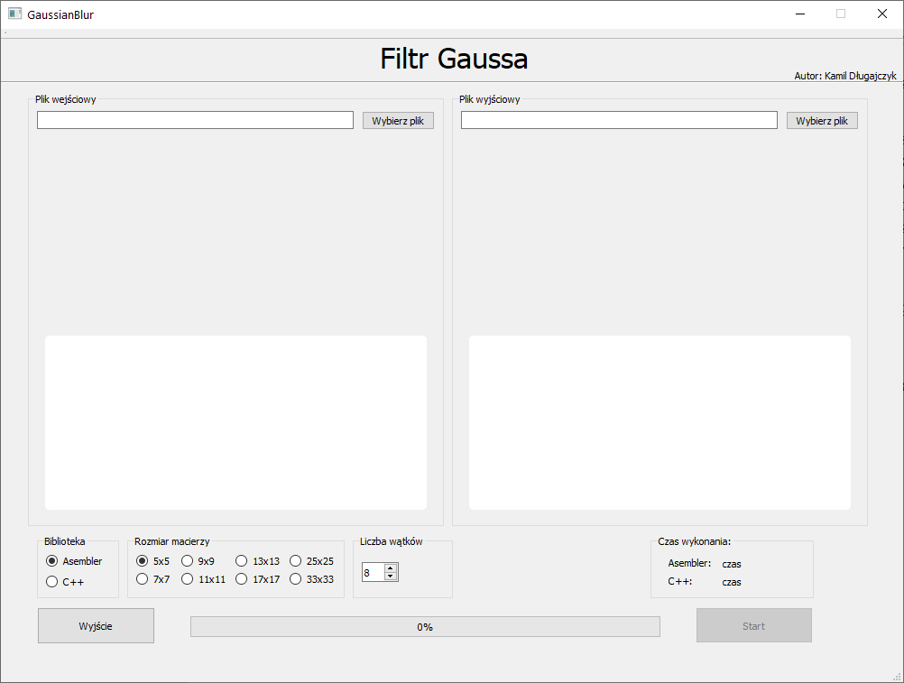
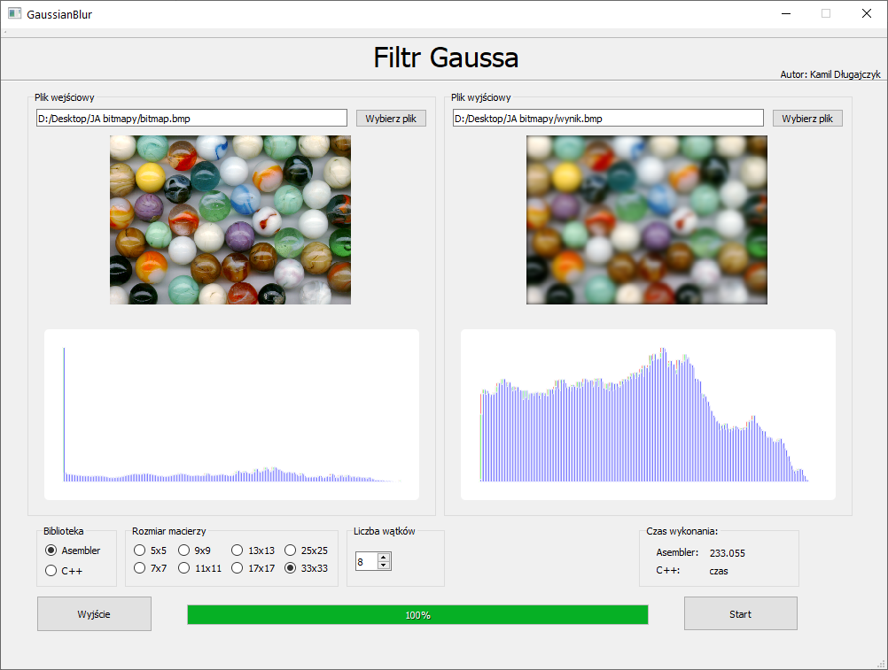

# Gaussian Blur
App that blurs 24 bit .bmp files using Gaussian Blur. Solution consists of main project written in c++ and QT, c++ .dll and x64 asm .dll  Assembly library uses SIMD operations. The point of this project is to compare the execution time of both libraries.

## Important! App supports only:
- 24 bit .bmp files
- BITMAPFILEHEADER
- Two DIB headers: BITMAPINFOHEADER and BITMAPV5HEADER

## Scrennshots

